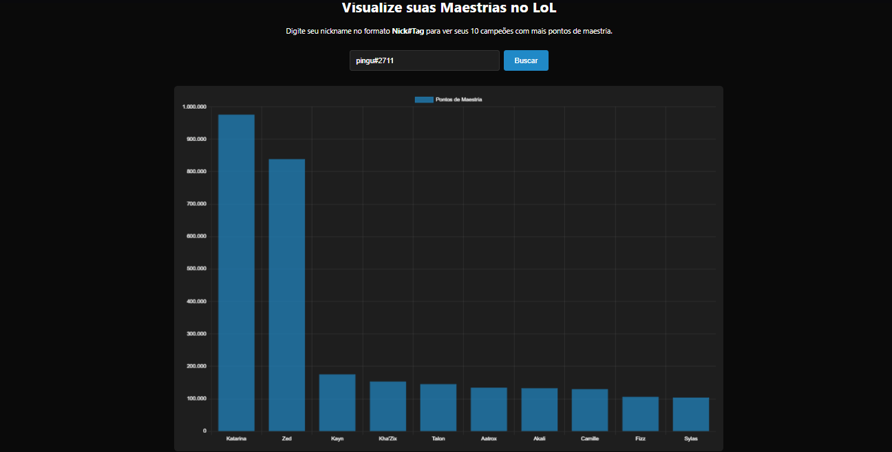

# LoL Mastery Tracker 🏆



Visualizador de maestrias de campeões do League of Legends via Riot API.

## ⚠️ Requisitos de Uso
1. Obtenha uma API key em [Riot Developer Portal](https://developer.riotgames.com/)
2. Crie um arquivo `.env` com:
```env
RIOT_API_KEY=sua_chave_aqui
```
3. **Nunca** compartilhe sua chave publicamente

## 🛠️ Como Usar Localmente
1. Renomeie `config.example.js` para `config.js`
2. Instale as dependências:
   ```bash
   npm install
   ```
3. Inicie o servidor:
   ```bash
   node server.js
   ```
6. Acesse `http://localhost:3000`

## ⚠️ Segurança
Nunca commit seu arquivo `config.js` ou compartilhe sua API key!

## 📜 Legal
Este projeto não é afiliado à Riot Games e utiliza a API conforme os 
[Termos de Desenvolvedor](https://developer.riotgames.com/policies/terms).

## 📝 Licença
MIT
